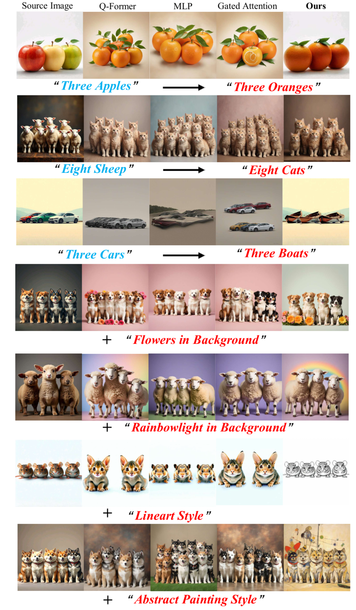

# IMAGHarmony: Controllable Image Editing with Consistent Object Quantity and Layout


<a href=''></a>
<a href=''></a>
<a href=''></a>
<a href=''></a>
[](https://github.com/muzishen/IMAGHarmony)


## 🗓️ Release


## 💡 Abstract:
Recent diffusion models have advanced image editing by enhancing visual quality and control, supporting broad applications across creative and personalized domains. However, current image editing largely overlooks multi-object scenarios, where precise control over object categories, counts, and spatial layouts remains a significant challenge.
To address this, we introduce a new task, quantity-and-layout consistent image editing (QL-Edit), which aims to enable fine-grained control of object quantity and spatial structure in complex scenes. 
We further propose IMAGHarmony, a structure-aware framework that incorporates harmony-aware attention (HA) to integrate multimodal semantics, explicitly modeling object counts and layouts to enhance editing accuracy and structural consistency.
In addition, we observe that diffusion models are susceptible to initial noise and exhibit strong preferences for specific noise patterns. 
Motivated by this, we present a preference-guided noise selection (PNS) strategy that chooses semantically aligned initial noise samples based on vision-language matching, thereby improving generation stability and layout consistency in multi-object editing.
To support evaluation, we construct HarmonyBench, a comprehensive benchmark covering diverse quantity and layout control scenarios.
Extensive experiments demonstrate that IMAGHarmony consistently outperforms state-of-the-art methods in structural alignment and semantic accuracy.


## 🚀 Dataset Demo


## 🚀 Examples




### Double_edit


## 🔧 Requirements

- Python>=3.8
- [PyTorch>=2.0.0](https://pytorch.org/)
- cuda>=11.8
```
conda create --name IMAGHarmony python=3.8.18
conda activate IMAGHarmony

# Install requirements
pip install -r requirements.txt
```
## 🌐 Download Models

You can download our models from [百度云](). You can download the other component models from the original repository, as follows.
- [h94/IP-Adapter](https://huggingface.co/h94/IP-Adapter)
- [stable-diffusion-XL](https://huggingface.co/stabilityai/stable-diffusion-xl-base-1.0)

## 🚀 How to train
```
# Please download the HarmonyBench data first or prepare your own images
# and modify the path in run.sh
## Write caption of your image in your train.json file 
# start training
sh train.sh
```
## 🚀 How to test
```
#Please convert your checkpionts
python conver_bin.py

#Please fill in your path in infer_new.py
#then run

python infer_new.py

#If you want to select a better result
#fill in your path in infer_seed.py and run it

python infer_seed.py
```
## Acknowledgement
We would like to thank the contributors to the [Instantstyle](https://github.com/instantX-research/InstantStyle) and [IP-Adapter](https://github.com/tencent-ailab/IP-Adapter) repositories, for their open research and exploration.

The IMAGHarmony code is available for both academic and commercial use. Users are permitted to generate images using this tool, provided they comply with local laws and exercise responsible use. The developers disclaim all liability for any misuse or unlawful activity by users.
## Citation
If you find IMAGDressing-v1 useful for your research and applications, please cite using this BibTeX:

```bibtex

```
## 🕒 TODO List
- [x] Paper
- [x] Train Code
- [x] Inference Code
- [ ] HarmonyBench Dataset
- [ ] Model Weights
## 📨 Contact
If you have any questions, please feel free to contact with us at shenfei140721@126.com and yutonggaokkk@njust.edu.cn.
