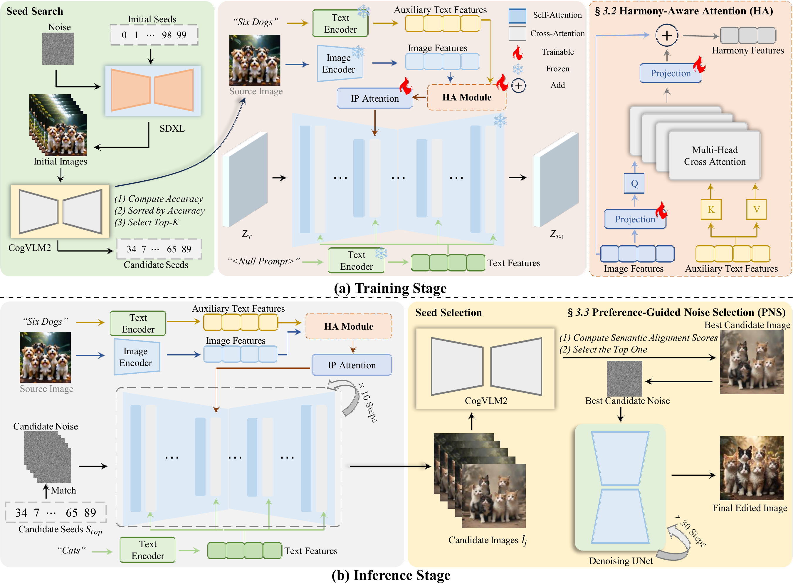
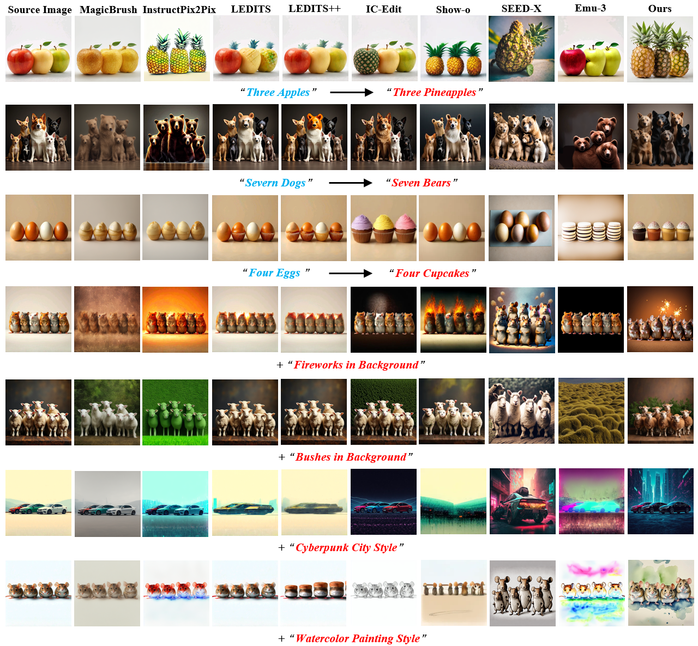
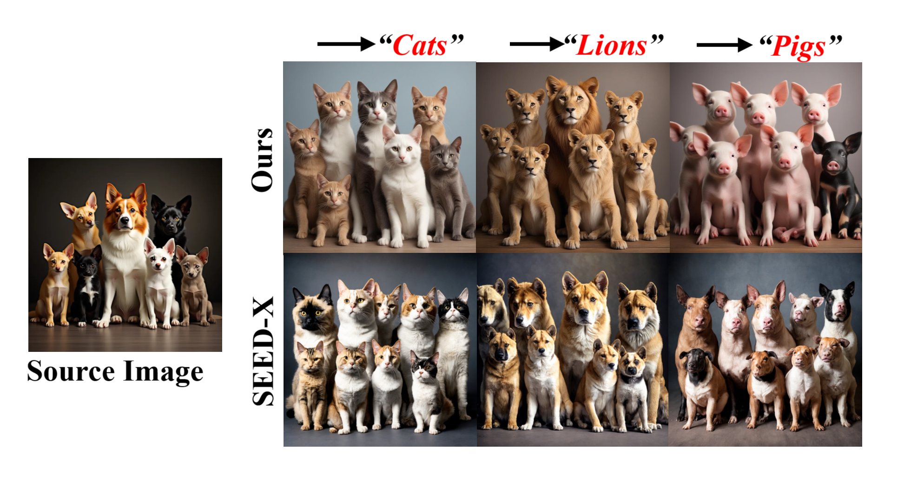
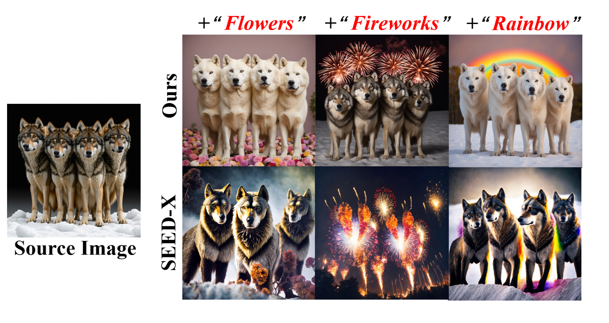
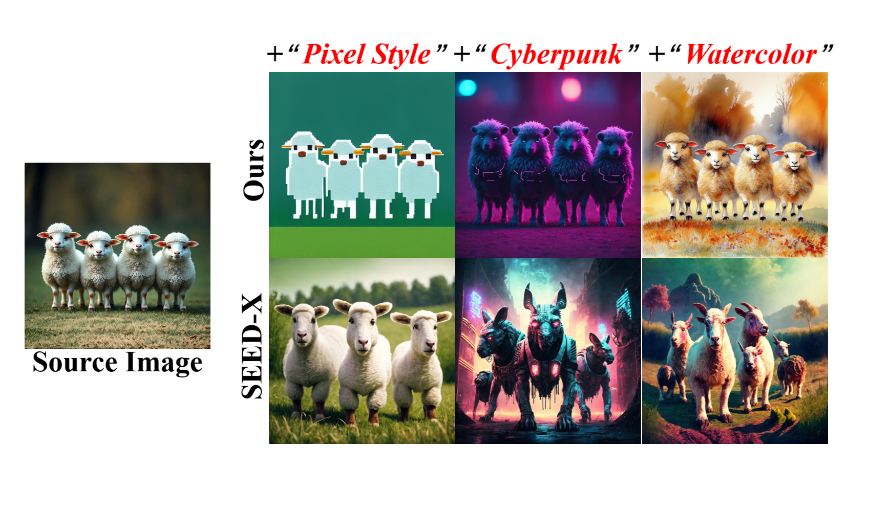
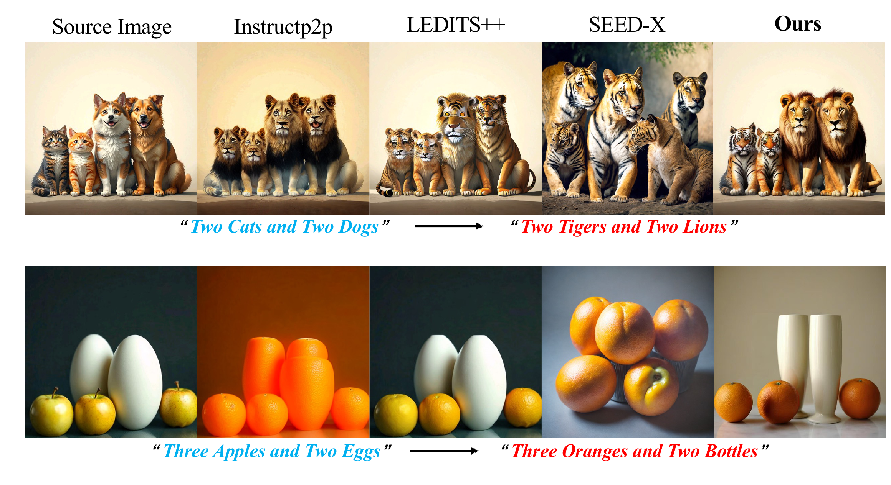

# IMAGHarmony: Controllable Image Editing with Consistent Object Quantity and Layout


<a href='https://revive234.github.io/IMAGHarmony.github.io/'></a>
<a href=''></a>
<a href=''></a>
<a href=''></a>
[](https://github.com/muzishen/IMAGHarmony)


## 🗓️ Release
- [2025/5/30] 🔥 We released the [technical report](https://arxiv.org/pdf/2504.13176) of IMAGHarmony.
- [2025/5/28] 🔥 We release the train and inference code of IMAGHarmony.
- [2025/5/17] 🎉 We launch the [project page](https://revive234.github.io/IMAGHarmony.github.io/) of IMAGHarmony.


## 💡 Introduction
IMAGHarmony tackles the challenge of controllable image editing in multi-object scenes, where existing models struggle with aligning object quantity and spatial layout.
To this end, IMAGHarmony introduces a structure-aware framework for quantity-and-layout consistent image editing (QL-Edit), enabling precise control over object count, category, and arrangement.
We propose a harmony-aware attention (HA) mechanism to jointly model object structure and semantics, and a preference-guided noise selection (PNS) strategy to stabilize generation by selecting semantically aligned initial noise.
Our method is trained and evaluated on HarmonyBench, a newly curated benchmark with diverse editing scenarios.



## 🚀 HarmonyBench Dataset Demo


## 🚀 Examples




### Class Editing


### Scene Editing


### Style Editing


### Dual-Category Editing



## 🔧 Requirements

- Python>=3.8
- [PyTorch>=2.0.0](https://pytorch.org/)
- cuda>=11.8
```
conda create --name IMAGHarmony python=3.8.18
conda activate IMAGHarmony

# Install requirements
pip install -r requirements.txt
```
## 🌐 Download Models

You can download our models from [百度云](). You can download the other component models from the original repository, as follows.
- [h94/IP-Adapter](https://huggingface.co/h94/IP-Adapter)
- [stable-diffusion-XL](https://huggingface.co/stabilityai/stable-diffusion-xl-base-1.0)

## 🚀 How to train
```
# Please download the HarmonyBench data first or prepare your own images
# and modify the path in run.sh
## Write caption of your image in your train.json file 
# start training

sh train.sh
```
## 🚀 How to test
```
#Please convert your checkpionts
python conver_bin.py

#Please fill in your path in test.py
#then run

python test.py
```
## Acknowledgement
We would like to thank the contributors to the [Instantstyle](https://github.com/instantX-research/InstantStyle) and [IP-Adapter](https://github.com/tencent-ailab/IP-Adapter) repositories, for their open research and exploration.

The IMAGHarmony code is available for both academic and commercial use. Users are permitted to generate images using this tool, provided they comply with local laws and exercise responsible use. The developers disclaim all liability for any misuse or unlawful activity by users.
## Citation
If you find IMAGDressing-v1 useful for your research and applications, please cite using this BibTeX:

```bibtex

```
## 🕒 TODO List
- [x] Paper
- [x] Train Code
- [x] Inference Code
- [ ] HarmonyBench Dataset
- [ ] Model Weights
## 📨 Contact
If you have any questions, please feel free to contact with us at shenfei140721@126.com and yutonggaokkk@njust.edu.cn.
