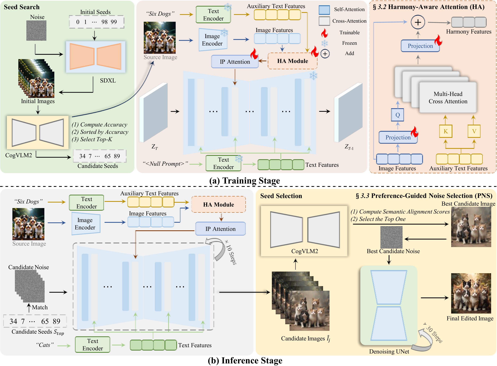
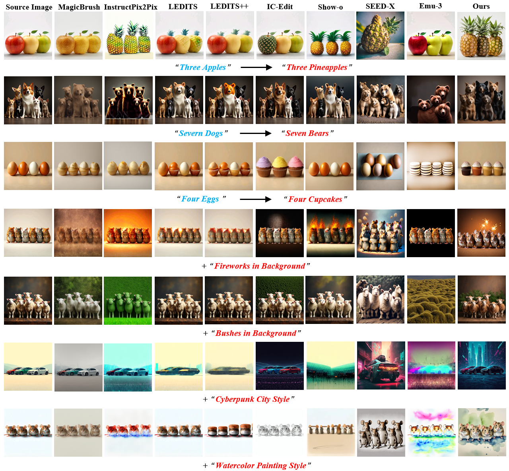
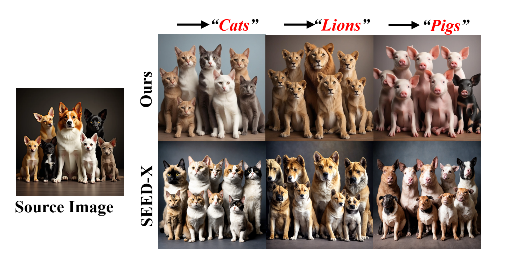
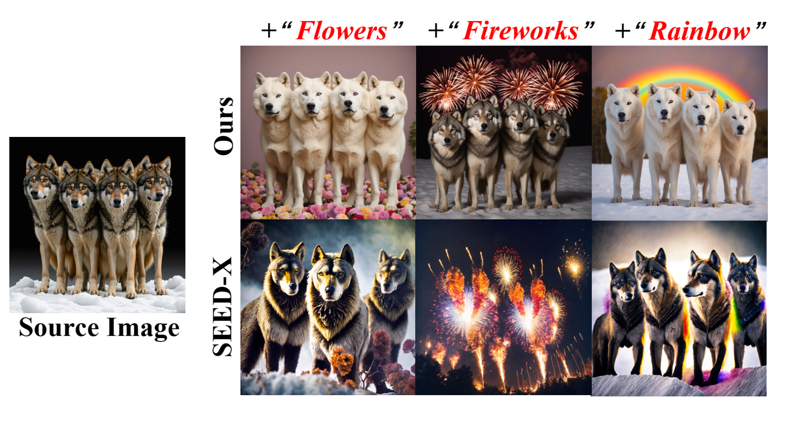
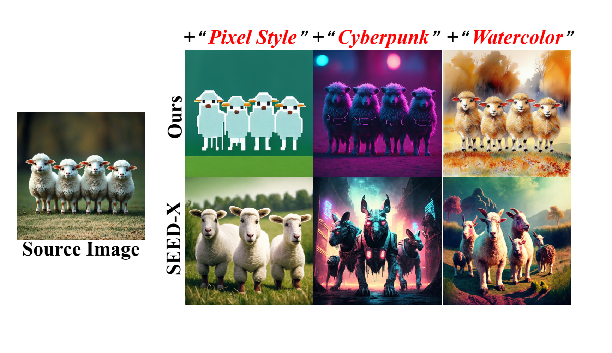
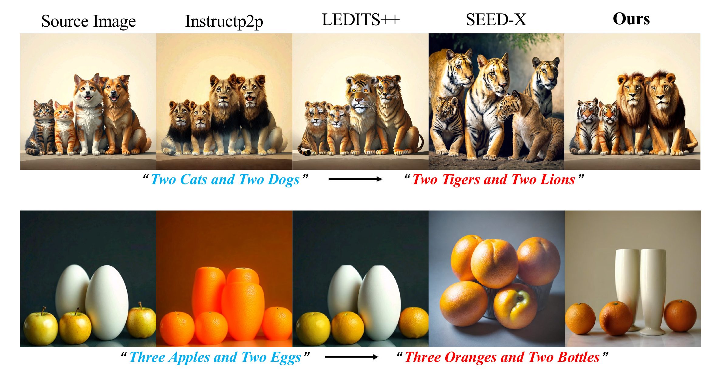

# IMAGHarmony: Controllable Image Editing with Consistent Object Quantity and Layout


<a href='https://revive234.github.io/IMAGHarmony.github.io/'></a>
<a href='https://arxiv.org/pdf/2506.01949'></a>
<a href='https://huggingface.co/kkkkggg/IMAGHarmony'></a>
<a href=''></a>


## 🗓️ Release
- [2025/5/30] 🔥 We released the [technical report](https://arxiv.org/pdf/2506.01949) of IMAGHarmony.
- [2025/5/28] 🔥 We release the train and inference code of IMAGHarmony.
- [2025/5/17] 🎉 We launch the [project page](https://revive234.github.io/IMAGHarmony.github.io/) of IMAGHarmony.


## 💡 Introduction
IMAGHarmony tackles the challenge of controllable image editing in multi-object scenes, where existing models struggle with aligning object quantity and spatial layout.
To this end, IMAGHarmony introduces a structure-aware framework for quantity-and-layout consistent image editing (QL-Edit), enabling precise control over object count, category, and arrangement.
We propose a harmony-aware attention (HA) mechanism to jointly model object structure and semantics, and a preference-guided noise selection (PNS) strategy to stabilize generation by selecting semantically aligned initial noise.
Our method is trained and evaluated on HarmonyBench, a newly curated benchmark with diverse editing scenarios.



## 🚀 HarmonyBench Dataset Demo


## 🚀 Examples




### Class Editing


### Scene Editing


### Style Editing


### Dual-Category Editing



## 🔧 Requirements

- Python>=3.8
- [PyTorch>=2.0.0](https://pytorch.org/)
- cuda>=11.8
```
conda create --name IMAGHarmony python=3.8.18
conda activate IMAGHarmony

# Install requirements
pip install -r requirements.txt
```
## 🌐 Download Models

You can download our models from [Huggingface](https://huggingface.co/kkkkggg/IMAGHarmony). You can download the other component models from the original repository, as follows.
- [h94/IP-Adapter](https://huggingface.co/h94/IP-Adapter)
- [stable-diffusion-XL](https://huggingface.co/stabilityai/stable-diffusion-xl-base-1.0)

## 🚀 How to train
```
# Please download the HarmonyBench data first or prepare your own images
# and modify the path in run.sh
## Write caption of your image in your train.json file 
# start training

sh train.sh
```
## 🚀 How to test
```
#Please convert your checkpionts
python conver_bin.py

#Please fill in your path in test.py
#then run

python test.py
```
Or you may like to test it on gradio
```
python demo.py
```


## Acknowledgement
We would like to thank the contributors to the [Instantstyle](https://github.com/instantX-research/InstantStyle) and [IP-Adapter](https://github.com/tencent-ailab/IP-Adapter) repositories, for their open research and exploration.

The IMAGHarmony code is available for both academic and commercial use. Users are permitted to generate images using this tool, provided they comply with local laws and exercise responsible use. The developers disclaim all liability for any misuse or unlawful activity by users.
## Citation
If you find IMAGHarmony useful for your research and applications, please cite using this BibTeX:

```bibtex
@article{shen2025imagharmony,
  title={IMAGHarmony: Controllable Image Editing with Consistent Object Quantity and Layout},
  author={Shen, Fei and Du, Xiaoyu and Gao, Yutong and Yu, Jian and Cao, Yushe and Lei, Xing and Tang, Jinhui},
  journal={arXiv preprint arXiv:2506.01949},
  year={2025}
}
```

## 🕒 TODO List
- [x] Paper
- [x] Train Code
- [x] Inference Code
- [ ] HarmonyBench Dataset
- [ ] Model Weights

## 👉 **Our other projects:**  
- [IMAGEdit](https://github.com/XWH-A/IMAGEdit): Training-Free Controllable Video Editing with Consistent Object Layout.  [可控多目标视频编辑]
- [IMAGDressing](https://github.com/muzishen/IMAGDressing): Controllable dressing generation. [可控穿衣生成]
- [IMAGGarment](https://github.com/muzishen/IMAGGarment): Fine-grained controllable garment generation.  [可控服装生成]
- [IMAGHarmony](https://github.com/muzishen/IMAGHarmony): Controllable image editing with consistent object layout.  [可控多目标图像编辑]
- [IMAGPose](https://github.com/muzishen/IMAGPose): Pose-guided person generation with high fidelity.  [可控多模式人物生成]
- [RCDMs](https://github.com/muzishen/RCDMs): Rich-contextual conditional diffusion for story visualization.  [可控故事生成]
- [PCDMs](https://github.com/tencent-ailab/PCDMs): Progressive conditional diffusion for pose-guided image synthesis. [可控人物生成]
- [V-Express](https://github.com/tencent-ailab/V-Express/): Explores strong and weak conditional relationships for portrait video generation. [可控数字人生成]
- [FaceShot](https://github.com/open-mmlab/FaceShot/): Talkingface plugin for any character. [可控动漫数字人生成]
- [CharacterShot](https://github.com/Jeoyal/CharacterShot): Controllable and consistent 4D character animation framework. [可控4D角色生成]
- [StyleTailor](https://github.com/mahb-THU/StyleTailor): An Agent for personalized fashion styling. [个性化时尚Agent]
- [SignVip](https://github.com/umnooob/signvip/): Controllable sign language video generation. [可控手语生成]

## 📨 Contact
If you have any questions, please feel free to contact with us at shenfei140721@126.com and yutonggaokkk@njust.edu.cn.
